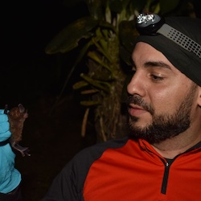
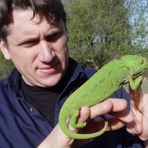

  <h2 class="post-title"  style="background-color:lightseagreen; text-align: center; width: 100%;" itemprop="headline">Danny Rojas</h2>
  

       
  Assistant Professor, Department of Natural Sciences and Mathematics, Pontificia Universidad Javeriana Cali (Colombia). <a href="https://rojasdanny.wordpress.com">Website</a>.
  

<!-- /.tile -->

  <h2 class="post-title"  style="background-color:lightseagreen; text-align: center; width: 100%;" itemprop="headline">John Wiens</h2>
  

       
  Professor, Department of Ecology & Evolutionary Biology, University of Arizona (USA). <a href="https://www.wienslab.com/Home.html">Website</a>.
  

<!-- /.tile -->

  <h2 class="post-title"  style="background-color:lightseagreen; text-align: center; width: 100%;" itemprop="headline">Eduardo Ferreira</h2>
  

       
  Assistant Researcher, CESAM & Department of Biology, University of Aveiro (Portugal). <a href="https://www.cienciavitae.pt/portal/en/581B-7ED8-3A0F">Website</a>.
  

<!-- /.tile -->

  <h2 class="post-title"  style="background-color:lightseagreen; text-align: center; width: 100%;" itemprop="headline">Carlos Fonseca</h2>
  

       
  Associate Professor, Department of Biology, University of Aveiro (Portugal). <a href="https://www.cienciavitae.pt/portal/en/8610-54AB-874A">Website</a>.
  

<!-- /.tile -->

<!-- /.tiles -->

        
