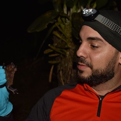
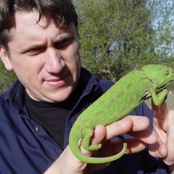
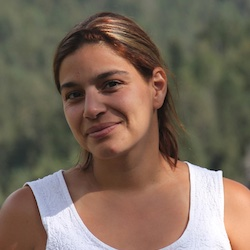
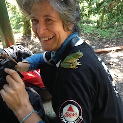
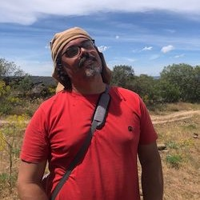
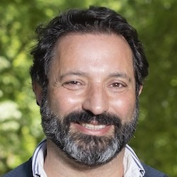

  <h2 class="post-title"  style="background-color:lightseagreen; text-align: center; width: 100%;" itemprop="headline"><a href="https://rojasdanny.wordpress.com/people/">Danny Rojas</a></h2>
  

       
  Assistant Professor, Department of Natural Sciences and Mathematics, Pontificia Universidad Javeriana Cali (Colombia).
  

<!-- /.tile -->

  <h2 class="post-title"  style="background-color:lightseagreen; text-align: center; width: 100%;" itemprop="headline"><a href="https://eeb.arizona.edu/person/john-wiens">John Wiens</a></h2>
  

       
  Professor, Department of Ecology & Evolutionary Biology, University of Arizona (USA).
  

<!-- /.tile -->

  <h2 class="post-title"  style="background-color:lightseagreen; text-align: center; width: 100%;" itemprop="headline"><a href="https://cibio.up.pt/en/people/details/silvia-ricardo-benoliel-de-carvalho/">Sílvia Carvalho</a></h2>
  

       
  Auxiliary Researcher, BIOPOLIS | CIBIO-InBIO, Campus Universitário de Vairão (Portugal).
  

<!-- /.tile -->

  <h2 class="post-title"  style="background-color:lightseagreen; text-align: center; width: 100%;" itemprop="headline"><a href="https://cibio.up.pt/en/people/details/angelica-crottini/">Angelica Crottini</a></h2>
  

       
  Auxiliary Researcher, BIOPOLIS | CIBIO-InBIO, Campus Universitário de Vairão (Portugal).
  

<!-- /.tile -->

  <h2 class="post-title"  style="background-color:lightseagreen; text-align: center; width: 100%;" itemprop="headline"><a href="https://www.cienciavitae.pt/portal/en/581B-7ED8-3A0F">Eduardo Ferreira</a></h2>
  

       
  Assistant Researcher, CESAM & Department of Biology, University of Aveiro (Portugal).
  

<!-- /.tile -->

  <h2 class="post-title"  style="background-color:lightseagreen; text-align: center; width: 100%;" itemprop="headline"><a href="https://www.cienciavitae.pt/portal/en/8610-54AB-874A">Carlos Fonseca</a></h2>
  

       
  Associate Professor, Department of Biology, University of Aveiro (Portugal).
  

<!-- /.tile -->

<!-- /.tiles -->

 

# Students

  <h2 class="post-title"  style="background-color:lightseagreen; text-align: center; width: 100%;" itemprop="headline"><a href="https://www.cibio.up.pt/en/people/details/maria-joao-paul/">Maria Paul</a></h2>
  

       
  PhD student, BIOPOLIS | CIBIO-InBIO, Campus Universitário de Vairão (Portugal).
  

<!-- /.tile -->

  <h2 class="post-title"  style="background-color:lightseagreen; text-align: center; width: 100%;" itemprop="headline"><a href="https://www.cibio.up.pt/en/people/details/mafalda-restelli/">Mafalda Restelli</a></h2>
  

       
  PhD student, BIOPOLIS | CIBIO-InBIO, Campus Universitário de Vairão (Portugal).
  

<!-- /.tile -->

<!-- /.tiles -->

  
