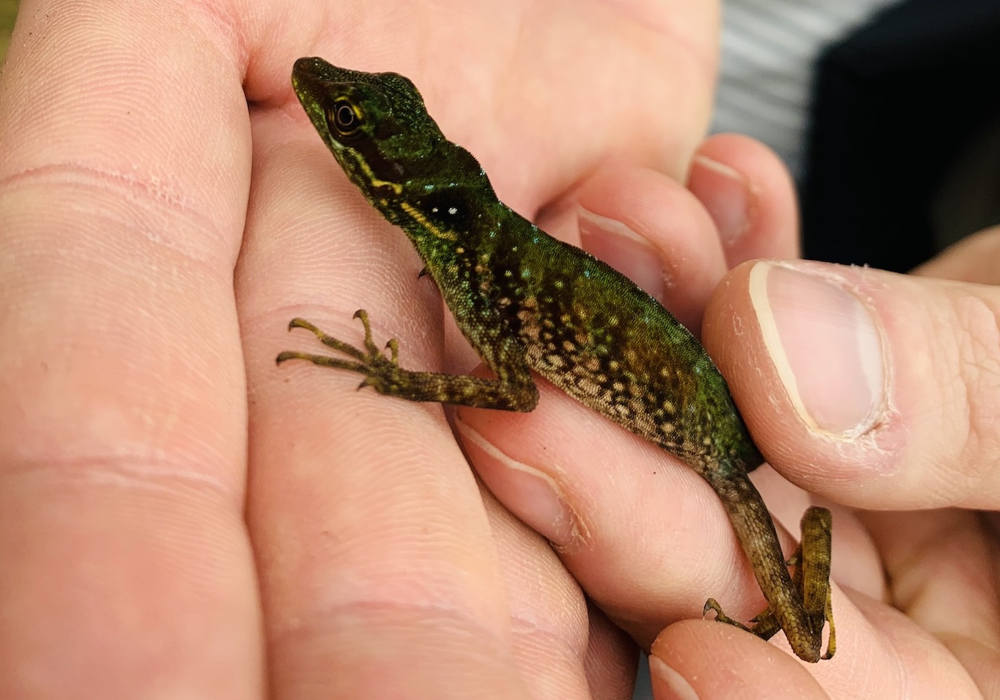
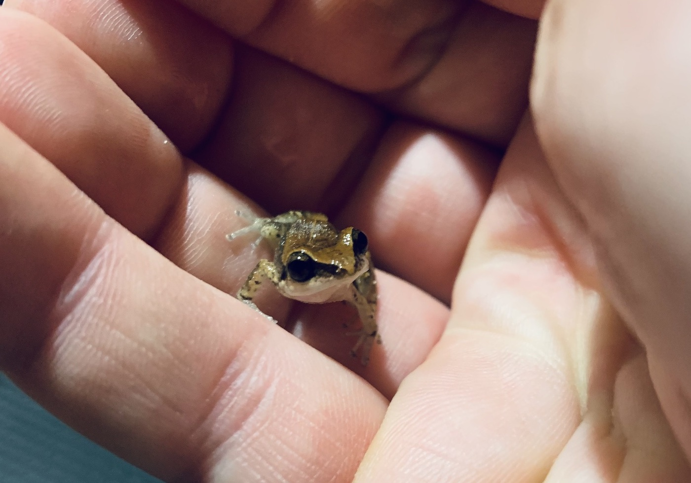
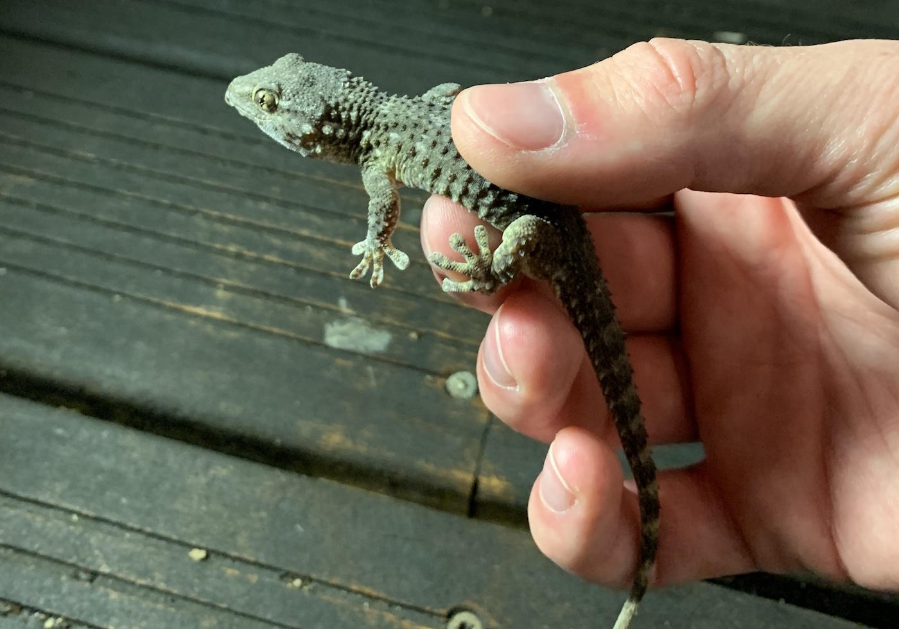
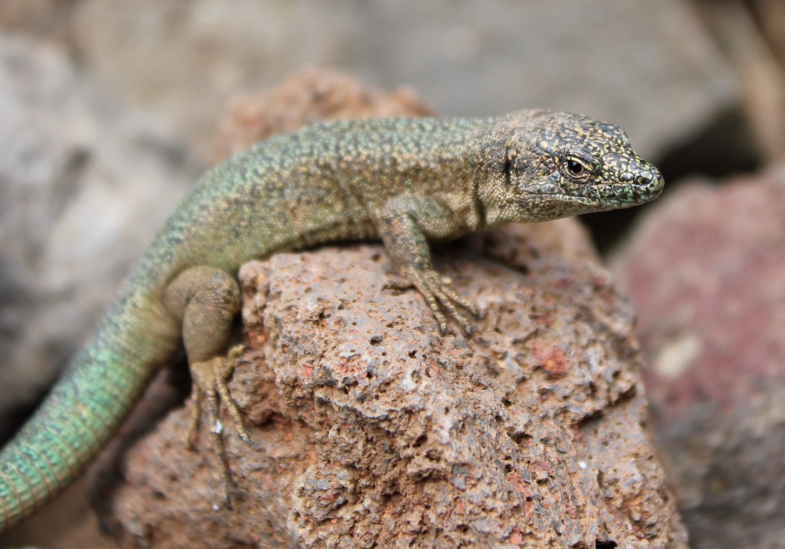
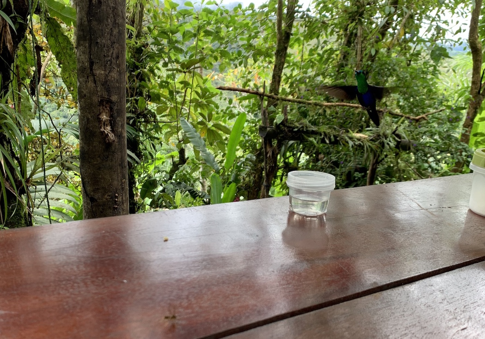
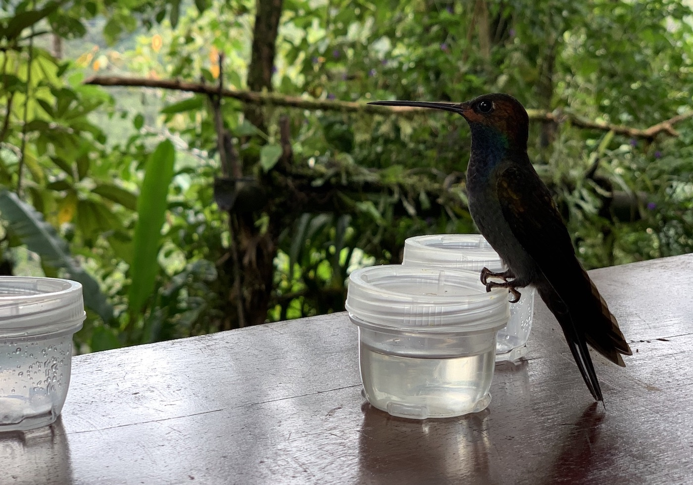
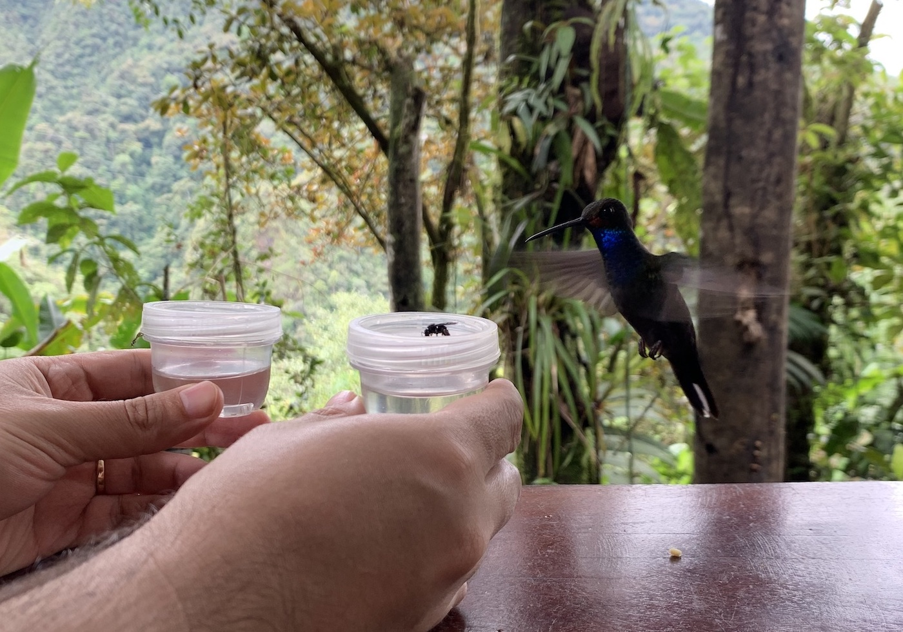
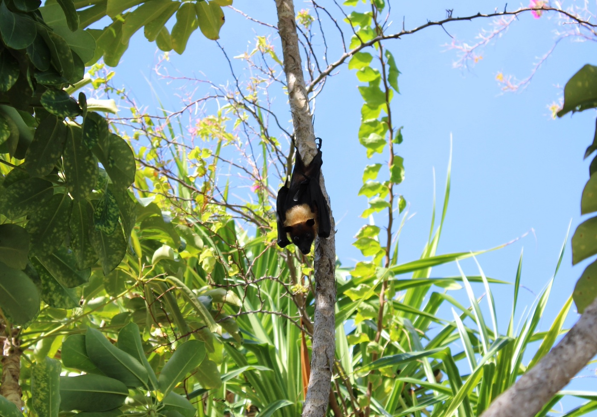

Loading...



## Herps

  

     
    Speckled Anole
    
    (<i>Anolis ventrimaculatus</i>)
  

<!-- /.tile -->
  

  

     
    Iberian Three-Toed Skink
    
    (<i>Chalcides striatus</i>)
  

<!-- /.tile -->
  

  

     
    Juvenile Rattlesnake
    
    (<i>Crotalus sp.</i>)
  

<!-- /.tile -->
 

  

     
    Ridge-Nosed Rattlesnake
    
    (<i>Crotalus willardi</i>)
  

<!-- /.tile -->

  

     
    Johnstone's Whistling Frog
    
    (<i>Eleutherodactylus johnstonei</i>)
  

<!-- /.tile -->

  

     
    Desert Spiny Lizard
    
    (<i>Sceloporus magister</i>)
  

<!-- /.tile -->
 

  

     
    Moorish Gecko
    
    (<i>Tarentola mauritanica</i>)
  

<!-- /.tile -->

  

     
    Madeira Wall Lizard
    
    (<i>Teira dugesii</i>)
  

<!-- /.tile -->

<!-- /.tiles -->

       

## Hummingbirds

  

     
    Crowned Woodnymph
    
    (<i>Thalurania colombica</i>)
  

<!-- /.tile -->

  

     
    Rufous-Gaped Hillstar
    
    (<i>Urochroa bougueri</i>)
  

<!-- /.tile -->

  

     
    Rufous-Gaped Hillstar
    
    (<i>Urochroa bougueri</i>)
  

<!-- /.tile -->

<!-- /.tiles -->

                       

## Invertebrates

## Bats

  

     
    Indian Flying Fox
    
    (<i>Pteropus medius</i>)
  

<!-- /.tile -->

<!-- /.tiles -->

                       

## Landscape
