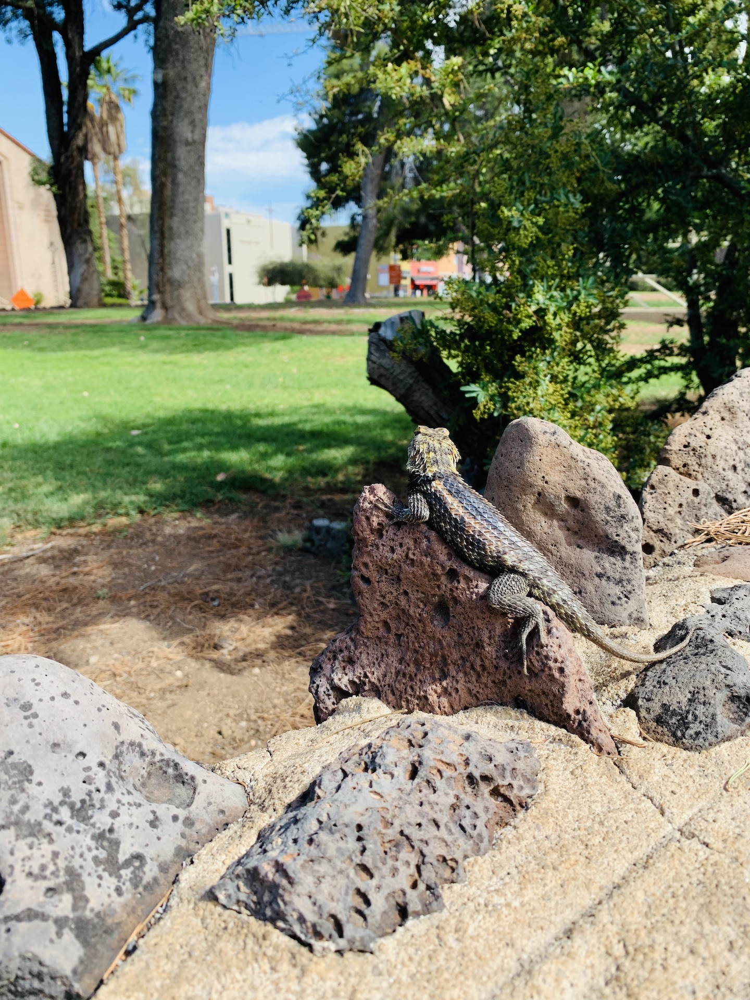
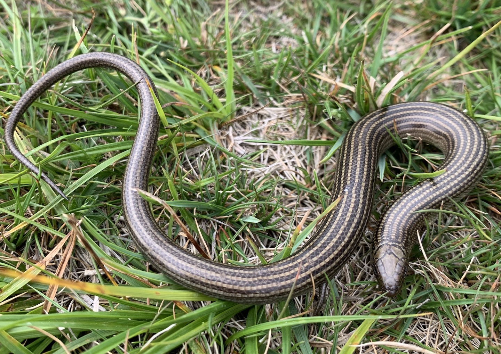
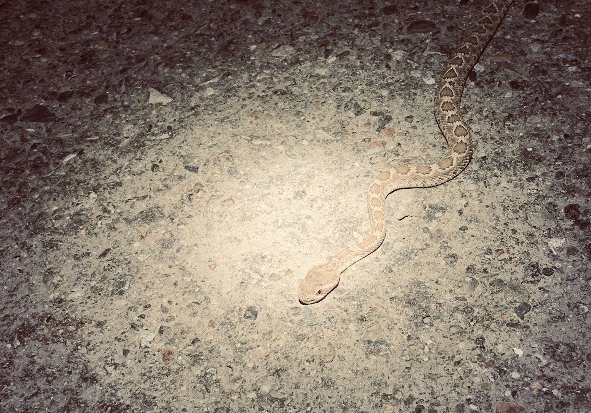
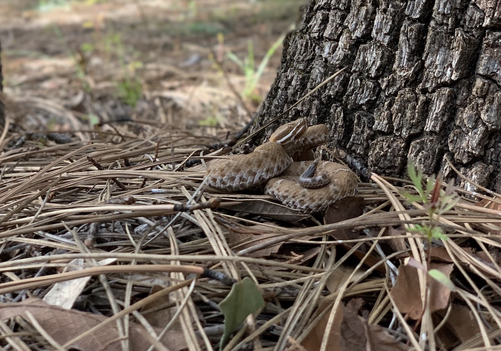

Loading...



## Herps

  

       
    <i>Sceloporus magister</i>
  

<!-- /.tile -->
 

  

       
    <i>Chalcides striatus</i>
  

<!-- /.tile -->
  

  

       
    <i>Crotalus sp.</i>
  

<!-- /.tile -->
 

  

       
    <i>Crotalus willardi</i>
  

<!-- /.tile -->
 

<!-- /.tiles -->

       

## Hummingbirds

## Invertebrates

## Bats

## Landscape
